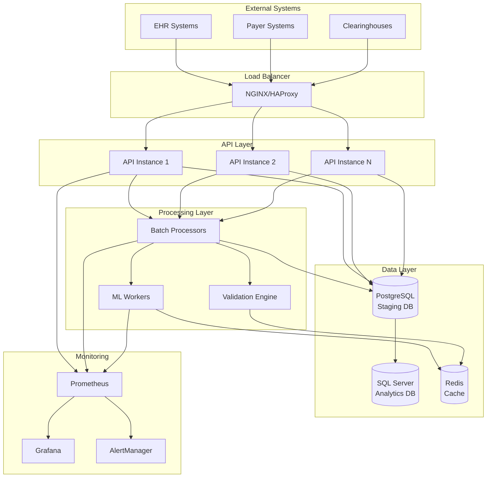

# System Architecture Overview

## Executive Summary

The 837P Claims Processing System is a high-performance, HIPAA-compliant platform designed to process 100,000 healthcare claims in 15 seconds while maintaining data security, audit compliance, and real-time analytics capabilities.

## Architecture Principles

### 1. **Performance First**
- Async processing with vectorized operations
- Multi-level caching strategies
- Predictive scaling and optimization
- Target: 6,667 claims/second sustained throughput

### 2. **Security by Design**
- HIPAA compliance with comprehensive audit logging
- AES-256 encryption for PHI data
- Role-based access control (RBAC)
- Zero-trust security model

### 3. **Scalability & Resilience**
- Horizontal scaling with predictive auto-scaling
- Circuit breaker patterns for fault tolerance
- Multi-database architecture for performance
- Container-native deployment

### 4. **Operational Excellence**
- Comprehensive monitoring and alerting
- Automated deployment pipelines
- Extensive testing coverage (unit, integration, performance)
- Configuration management for multiple environments

## High-Level Architecture



## Core Components

### 1. **API Gateway & Load Balancing**
- **Technology**: FastAPI with NGINX/HAProxy
- **Features**: Rate limiting, authentication, request routing
- **Scaling**: Auto-scaling based on response times and error rates
- **Security**: JWT authentication, CORS protection, security headers

### 2. **Processing Pipeline**
- **Ultra-High Performance Pipeline**: Async batch processing
- **Validation Engine**: 200+ business rules with Python rule-engine
- **ML Pipeline**: TensorFlow/PyTorch for intelligent claims filtering
- **Queue Management**: Redis-based priority queuing

### 3. **Data Architecture**
- **Staging Database**: PostgreSQL with optimized indexes and partitioning
- **Analytics Database**: SQL Server with columnstore indexes
- **Cache Layer**: Redis with intelligent preloading
- **File Storage**: Distributed file system for document attachments

### 4. **Security Framework**
- **Encryption**: AES-256 for data at rest, TLS 1.3 for data in transit
- **Access Control**: Role-based with 10 predefined roles
- **Audit Logging**: Comprehensive PHI access tracking
- **Session Management**: JWT with refresh tokens and timeout

## Data Flow

### 1. **Claim Ingestion**
```
EHR/Payer → API Gateway → Authentication → Validation → Queue
```

### 2. **Batch Processing**
```
Queue → Batch Processor → ML Filter → Business Rules → Database
```

### 3. **Failed Claims Handling**
```
Failed Validation → Failed Claims DB → UI Dashboard → Manual Review
```

### 4. **Analytics Pipeline**
```
Staging DB → ETL Process → Analytics DB → Materialized Views → Dashboards
```

## Performance Architecture

### Throughput Optimization
- **Vectorized Operations**: NumPy/Pandas for data processing
- **Async Processing**: AsyncIO for I/O bound operations
- **Connection Pooling**: Optimized database connection management
- **Batch Processing**: Intelligent batch sizing based on system load

### Caching Strategy
- **L1 Cache**: In-memory application cache
- **L2 Cache**: Redis distributed cache
- **L3 Cache**: Database query result caching
- **Predictive Preloading**: ML-based cache warming

### Auto-Scaling
- **Horizontal Scaling**: Container-based scaling
- **Predictive Scaling**: ML models predict load spikes
- **Resource Monitoring**: CPU, memory, queue depth analysis
- **Cooldown Periods**: Prevent scaling oscillation

## Security Architecture

### Data Protection
- **PHI Encryption**: Field-level encryption for sensitive data
- **Database Encryption**: Transparent data encryption (TDE)
- **Backup Encryption**: Encrypted backups with key rotation
- **Network Security**: VPN, firewalls, network segmentation

### Access Control
- **Authentication**: Multi-factor authentication support
- **Authorization**: Fine-grained permissions
- **Session Security**: Secure session management
- **API Security**: Rate limiting, input validation

### Compliance
- **HIPAA**: Comprehensive compliance framework
- **Audit Trails**: Immutable audit logging
- **Data Retention**: Automated retention policies
- **Breach Detection**: Anomaly detection and alerting

## Monitoring & Observability

### Metrics Collection
- **Application Metrics**: Custom business metrics
- **Infrastructure Metrics**: System resource utilization
- **Database Metrics**: Query performance, connection pools
- **Security Metrics**: Failed login attempts, access patterns

### Alerting
- **Threshold-Based**: CPU, memory, response time alerts
- **Anomaly Detection**: Statistical analysis for unusual patterns
- **Business Rules**: Claims processing rate, error rate monitoring
- **Security Alerts**: Potential security incidents

### Dashboards
- **Operations Dashboard**: Real-time system health
- **Business Dashboard**: Claims processing metrics
- **Security Dashboard**: Access and audit information
- **Performance Dashboard**: Throughput and latency metrics

## Deployment Architecture

### Environment Strategy
- **Development**: Local development with Docker Compose
- **Staging**: Production-like environment for testing
- **Production**: High-availability cluster deployment

### Container Orchestration
- **Docker**: Application containerization
- **Kubernetes**: Container orchestration and scaling
- **Helm**: Package management and deployment
- **Service Mesh**: Inter-service communication and security

### CI/CD Pipeline
- **Source Control**: Git with feature branch workflow
- **Build**: Automated testing and container building
- **Deployment**: Blue-green deployments with rollback capability
- **Monitoring**: Deployment health monitoring

## Disaster Recovery

### Backup Strategy
- **Database Backups**: Automated daily backups with point-in-time recovery
- **Configuration Backups**: Infrastructure as code
- **Application Backups**: Container image registry
- **Cross-Region Replication**: Geographic distribution

### Recovery Procedures
- **RTO**: Recovery Time Objective < 4 hours
- **RPO**: Recovery Point Objective < 1 hour
- **Failover**: Automated failover for critical components
- **Testing**: Regular disaster recovery drills

## Capacity Planning

### Current Capacity
- **Processing**: 6,667 claims/second sustained
- **Storage**: Petabyte-scale data storage
- **Compute**: Auto-scaling from 2-20 instances
- **Network**: 10Gbps network capacity

### Growth Planning
- **Horizontal Scaling**: Linear scaling with demand
- **Performance Monitoring**: Continuous capacity analysis
- **Cost Optimization**: Resource utilization optimization
- **Technology Refresh**: Regular technology updates

---

This architecture provides a robust, scalable, and secure foundation for high-volume claims processing while maintaining compliance and operational excellence.