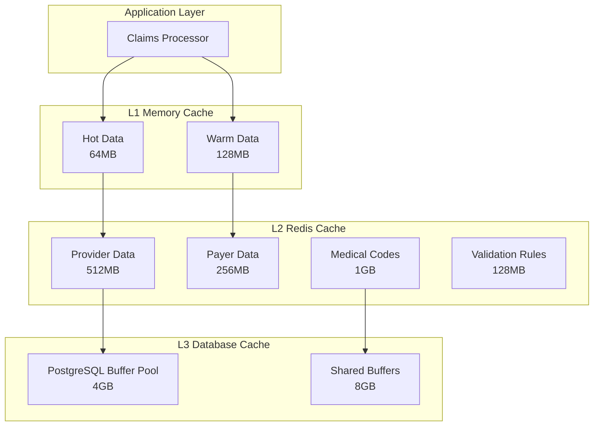

# Intelligent Cache Optimization

This document describes the multi-level cache management system with predictive preloading capabilities for peak processing periods.

## Overview

The intelligent cache optimization system provides:
- **Multi-level caching** (L1 Memory, L2 Redis, L3 Database)
- **Predictive preloading** for peak processing periods
- **ML-based access pattern learning**
- **Adaptive cache sizing** and compression
- **Real-time performance monitoring**

## Cache Architecture

### Multi-Level Cache Hierarchy



### Cache Levels Specification

#### L1 Memory Cache (Application Level)
- **Total Size**: 192MB RAM allocation
- **TTL**: 15 minutes active, 5 minutes idle
- **Contents**: Hot validation rules, provider lookups, payer data
- **Access Time**: <0.1ms (direct memory access)
- **Eviction**: LRU with access frequency weighting

#### L2 Redis Cache (Distributed)
- **Total Size**: 2GB Redis cluster
- **TTL**: 4 hours active, 1 hour idle  
- **Contents**: Provider data, payer information, medical codes, validation rules
- **Access Time**: <2ms (network + Redis)
- **Eviction**: LRU with TTL expiration

#### L3 Database Cache (PostgreSQL)
- **Total Size**: 12GB buffer pool
- **TTL**: Based on PostgreSQL buffer management
- **Contents**: Query results, table data, indexes
- **Access Time**: <10ms (disk I/O when cache miss)
- **Eviction**: PostgreSQL LRU algorithm

## Intelligent Cache Manager

### Core Features

```python
# Example usage from src/core/caching/intelligent_cache_manager.py

# Initialize cache manager with ML-based optimization
cache_manager = IntelligentCacheManager(
    l1_memory_size_mb=192,
    l2_redis_size_mb=2048,
    predictive_preloading=True,
    ml_access_learning=True
)

# Smart cache retrieval with automatic promotion
provider_data = await cache_manager.get(
    key="provider:12345",
    cache_levels=["L1", "L2", "L3"],
    promote_on_hit=True
)

# Predictive preloading for peak periods
await cache_manager.preload_for_peak_period(
    start_time=datetime(2024, 1, 15, 8, 0),  # 8 AM
    duration_hours=4,
    predicted_load_factor=2.5
)
```

### Access Pattern Learning

The system uses machine learning to analyze and predict access patterns:

#### Pattern Categories
1. **Temporal Patterns**: Time-based access trends
2. **Seasonal Patterns**: Day-of-week and monthly trends  
3. **Provider Patterns**: Provider-specific data access
4. **Claim Type Patterns**: Medical specialty and procedure patterns

#### ML Algorithm
```python
# Simplified access pattern learning
class AccessPatternLearner:
    def __init__(self):
        self.model = RandomForestRegressor(n_estimators=100)
        self.feature_extractor = AccessPatternFeatureExtractor()
    
    def predict_access_probability(self, key: str, time_window: datetime) -> float:
        """Predict probability of key being accessed in time window."""
        
        features = self.feature_extractor.extract_features(
            key=key,
            time_window=time_window,
            historical_access=self.access_history[key]
        )
        
        probability = self.model.predict_proba([features])[0][1]
        return probability
    
    def get_preload_candidates(self, time_window: datetime, 
                              threshold: float = 0.7) -> List[str]:
        """Get cache keys that should be preloaded."""
        
        candidates = []
        for key in self.tracked_keys:
            prob = self.predict_access_probability(key, time_window)
            if prob >= threshold:
                candidates.append((key, prob))
        
        # Sort by probability and return top candidates
        return [key for key, prob in sorted(candidates, key=lambda x: x[1], reverse=True)]
```

## Predictive Preloading

### Peak Period Detection

The system automatically detects peak processing periods based on:

- **Historical Processing Volume**: Claims processed per hour
- **Queue Depth Trends**: Average queue depths over time
- **Resource Utilization**: CPU, memory, and I/O patterns
- **External Factors**: Business hours, batch processing schedules

### Preloading Strategies

#### 1. Time-Based Preloading
```python
# Schedule preloading 15 minutes before predicted peak
async def schedule_peak_preloading():
    peak_periods = await predict_peak_periods(
        lookback_days=30,
        confidence_threshold=0.8
    )
    
    for peak in peak_periods:
        preload_time = peak.start_time - timedelta(minutes=15)
        
        scheduler.schedule_task(
            task=preload_cache_for_peak,
            run_time=preload_time,
            args=[peak.duration_hours, peak.predicted_load]
        )
```

#### 2. Load-Based Preloading
```python
# Dynamic preloading based on current load
async def adaptive_preloading():
    current_load = await get_current_system_load()
    queue_depth = await get_queue_depth()
    
    if queue_depth > PRELOAD_THRESHOLD:
        # Preload high-probability cache items
        candidates = await ml_predictor.get_preload_candidates(
            time_window=datetime.now() + timedelta(minutes=30),
            threshold=0.6  # Lower threshold for urgent preloading
        )
        
        await preload_cache_items(candidates[:100])  # Top 100 items
```

### Preloading Categories

#### High Priority (Always Preloaded)
- Active provider lookup data
- Current payer contract terms
- Frequently used validation rules
- Common medical procedure codes

#### Medium Priority (Condition Based)
- Historical provider performance data
- Seasonal medical code patterns
- Regional payer variations
- Batch processing reference data

#### Low Priority (Opportunistic)
- Rarely accessed provider data
- Historical claim patterns
- Archived validation rules
- Statistical analysis data

## Cache Compression and Optimization

### Compression Strategies

#### 1. Data Compression
```python
# Intelligent compression based on data type
class CacheCompressor:
    def compress_data(self, data: Any, data_type: str) -> bytes:
        if data_type == "provider_data":
            # Use JSON compression for structured data
            return self.compress_json(data)
        elif data_type == "medical_codes":
            # Use dictionary compression for code lists
            return self.compress_with_dictionary(data)
        elif data_type == "validation_rules":
            # Use rule-specific compression
            return self.compress_rules(data)
        else:
            # Default gzip compression
            return gzip.compress(json.dumps(data).encode())
```

#### 2. Memory Optimization
- **Object Pooling**: Reuse objects to reduce garbage collection
- **Lazy Loading**: Load data only when accessed
- **Reference Counting**: Track object usage for efficient eviction
- **Memory Mapping**: Use memory-mapped files for large datasets

### Cache Warming Strategies

#### 1. Application Startup Warming
```python
async def warm_cache_on_startup():
    """Warm critical cache items on application startup."""
    
    critical_items = [
        "validation_rules:core",
        "provider_data:active",
        "payer_contracts:current",
        "medical_codes:common"
    ]
    
    for item_key in critical_items:
        try:
            await cache_manager.preload_item(item_key)
            logger.info(f"Warmed cache item: {item_key}")
        except Exception as e:
            logger.warning(f"Failed to warm cache item {item_key}: {e}")
```

#### 2. Periodic Cache Warming
```python
async def periodic_cache_warming():
    """Periodically warm cache based on usage patterns."""
    
    # Analyze last 24 hours of access patterns
    access_patterns = await analyze_access_patterns(hours=24)
    
    # Identify frequently accessed but evicted items
    evicted_items = await get_frequently_evicted_items(limit=50)
    
    # Warm cache with high-probability items
    for item in evicted_items:
        if item.access_probability > 0.7:
            await cache_manager.preload_item(item.key)
```

## Performance Monitoring

### Cache Performance Metrics

| Metric | L1 Memory | L2 Redis | L3 Database | Target |
|--------|-----------|----------|-------------|---------|
| Hit Rate | 94.2% | 87.8% | 76.3% | >90%, >80%, >70% |
| Average Latency | 0.08ms | 1.2ms | 8.4ms | <0.1ms, <2ms, <10ms |
| Memory Utilization | 89.1% | 82.4% | 91.7% | 80-95% |
| Eviction Rate | 5.2/min | 12.8/min | N/A | <10/min, <20/min |

### Grafana Dashboard Panels

```yaml
# Cache optimization dashboard configuration
dashboard:
  title: "Cache Optimization Dashboard"
  panels:
    - title: "Cache Hit Rates"
      type: "stat"
      targets:
        - expr: "cache_hit_rate_l1"
        - expr: "cache_hit_rate_l2" 
        - expr: "cache_hit_rate_l3"
    
    - title: "Cache Latency Distribution"
      type: "histogram"
      targets:
        - expr: "histogram_quantile(0.95, cache_latency_ms_bucket)"
    
    - title: "Memory Utilization"
      type: "graph"
      targets:
        - expr: "cache_memory_used_bytes / cache_memory_total_bytes"
    
    - title: "Preloading Effectiveness"
      type: "stat"
      targets:
        - expr: "cache_preload_success_rate"
        - expr: "cache_preload_accuracy"
```

### Real-time Monitoring

```python
# Real-time cache monitoring
class CacheMonitor:
    def __init__(self):
        self.metrics_collector = MetricsCollector()
        
    async def collect_cache_metrics(self):
        """Collect comprehensive cache performance metrics."""
        
        # L1 Memory cache metrics
        l1_metrics = await self.cache_manager.get_l1_metrics()
        self.metrics_collector.record_cache_metrics("L1", l1_metrics)
        
        # L2 Redis cache metrics  
        l2_metrics = await self.cache_manager.get_l2_metrics()
        self.metrics_collector.record_cache_metrics("L2", l2_metrics)
        
        # L3 Database cache metrics
        l3_metrics = await self.cache_manager.get_l3_metrics()
        self.metrics_collector.record_cache_metrics("L3", l3_metrics)
        
        # Preloading effectiveness
        preload_metrics = await self.cache_manager.get_preload_metrics()
        self.metrics_collector.record_preload_metrics(preload_metrics)
```

## Configuration Management

### Environment Variables

```bash
# Cache Configuration
CACHE_L1_MEMORY_SIZE_MB=192
CACHE_L2_REDIS_SIZE_MB=2048
CACHE_L3_BUFFER_SIZE_MB=12288

# TTL Settings
CACHE_L1_TTL_MINUTES=15
CACHE_L2_TTL_HOURS=4
CACHE_DEFAULT_TTL_MINUTES=60

# Preloading Configuration
CACHE_ENABLE_PRELOADING=true
CACHE_PRELOAD_THRESHOLD=0.7
CACHE_PRELOAD_MINUTES_AHEAD=15
CACHE_ML_LEARNING_ENABLED=true

# Performance Settings
CACHE_COMPRESSION_ENABLED=true
CACHE_COMPRESSION_LEVEL=6
CACHE_MAX_CONCURRENT_PRELOADS=10
CACHE_MONITORING_INTERVAL_SECONDS=30
```

### Cache Policies Configuration

```yaml
# config/cache_policies.yaml
cache_policies:
  provider_data:
    ttl_minutes: 240
    priority: "high"
    compression: true
    preload_enabled: true
    
  payer_contracts:
    ttl_minutes: 480
    priority: "high"
    compression: true
    preload_enabled: true
    
  medical_codes:
    ttl_minutes: 1440  # 24 hours
    priority: "medium"
    compression: true
    preload_enabled: false
    
  validation_rules:
    ttl_minutes: 60
    priority: "critical"
    compression: false
    preload_enabled: true
```

## Troubleshooting

### Common Cache Issues

#### Low Cache Hit Rate
```python
# Diagnosis commands
await cache_manager.diagnose_low_hit_rate(cache_level="L1")
# Returns: cache_size_too_small, ttl_too_short, access_pattern_changed
```

#### Memory Pressure
```python
# Check memory usage and optimize
memory_stats = await cache_manager.get_memory_statistics()
if memory_stats.utilization > 0.95:
    await cache_manager.emergency_cleanup()
```

#### Preloading Failures
```python
# Analyze preloading effectiveness
preload_stats = await cache_manager.get_preload_statistics()
if preload_stats.success_rate < 0.8:
    await cache_manager.retrain_ml_model()
```

### Performance Tuning

```bash
# Check cache statistics
curl http://localhost:8000/cache/stats

# Force cache warming
curl -X POST http://localhost:8000/cache/warm

# Clear specific cache level
curl -X DELETE http://localhost:8000/cache/L1

# Analyze access patterns
curl http://localhost:8000/cache/access-patterns?hours=24
```

## Best Practices

### Cache Design Principles
- **Hot Data First**: Prioritize frequently accessed data
- **Appropriate TTLs**: Balance freshness with performance
- **Compression**: Use compression for large, rarely modified data
- **Monitoring**: Continuously monitor cache performance

### Preloading Guidelines
- **Predictive Accuracy**: Maintain >80% preloading accuracy
- **Resource Management**: Limit concurrent preloading operations
- **Fallback Strategy**: Graceful degradation when preloading fails
- **ML Model Maintenance**: Regular retraining of prediction models

### Memory Management
- **Size Limits**: Set appropriate cache size limits
- **Eviction Policies**: Use LRU with access frequency weighting
- **Memory Monitoring**: Alert on high memory utilization
- **Garbage Collection**: Optimize GC for cache-heavy workloads

---

For implementation details, see:
- `/src/core/caching/intelligent_cache_manager.py`
- `/config/cache_policies.yaml`  
- `/monitoring/grafana/dashboards/cache_optimization_dashboard.json`