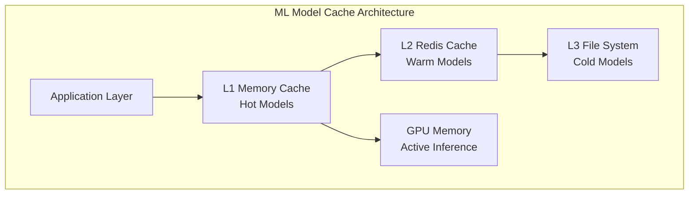

# ML Model Optimization

This document describes the advanced ML model caching and batch inference optimization systems implemented for high-performance claims processing.

## Overview

The ML optimization system provides:
- **Multi-level model caching** (L1 memory, L2 Redis)
- **Intelligent batch inference** with adaptive sizing
- **GPU optimization** with model quantization
- **Background optimization workers**
- **Performance monitoring** and auto-tuning

## Model Caching System

### Architecture



### Cache Levels

#### L1 Memory Cache (Hot Models)
- **Size**: 2GB RAM allocation
- **TTL**: 30 minutes active, 10 minutes idle
- **Contents**: Frequently used models in native format
- **Access Time**: <1ms model retrieval

#### L2 Redis Cache (Warm Models)
- **Size**: 8GB Redis allocation
- **TTL**: 4 hours active, 1 hour idle
- **Contents**: Serialized models with metadata
- **Access Time**: <10ms model retrieval

#### L3 File System (Cold Models)
- **Storage**: SSD-based model repository
- **Contents**: All trained models with versioning
- **Access Time**: <100ms model loading

### Cache Management Features

```python
# Example usage from src/processing/ml_pipeline/model_cache_manager.py

# Initialize cache manager
cache_manager = MLModelCacheManager(
    l1_memory_limit_gb=2.0,
    l2_redis_limit_gb=8.0,
    gpu_memory_limit_gb=4.0
)

# Load model with automatic caching
model = await cache_manager.get_model(
    model_name="claims_filter_v2.1",
    version="latest",
    priority_level=ModelPriority.HIGH
)

# Batch inference with optimization
results = await cache_manager.batch_inference(
    model_name="claims_filter_v2.1",
    inputs=claim_batch,
    batch_size="auto"  # Adaptive batch sizing
)
```

## Batch Inference Optimization

### Adaptive Batch Sizing

The system automatically determines optimal batch sizes based on:

- **GPU Memory Availability**: Maximizes GPU utilization
- **Model Complexity**: Adjusts for transformer vs. CNN models
- **Input Data Size**: Considers claim data volume
- **System Load**: Reduces batch size under high load

### Performance Optimizations

#### Model Quantization
- **FP16 Precision**: 2x memory reduction, minimal accuracy loss
- **INT8 Quantization**: 4x memory reduction for inference
- **Dynamic Quantization**: Runtime optimization

#### Memory Management
- **Gradient Accumulation**: For large effective batch sizes
- **Memory Pinning**: Faster CPU-GPU data transfer
- **Garbage Collection**: Proactive memory cleanup

#### Parallel Processing
- **Multi-GPU Support**: Automatic model parallelism
- **Pipeline Parallelism**: Overlapped compute and I/O
- **Asynchronous Inference**: Non-blocking model calls

## Configuration

### Environment Variables

```bash
# Model Cache Configuration
ML_CACHE_L1_MEMORY_GB=2.0
ML_CACHE_L2_REDIS_GB=8.0
ML_CACHE_GPU_MEMORY_GB=4.0
ML_CACHE_TTL_MINUTES=30

# Batch Inference Configuration
ML_BATCH_SIZE_AUTO=true
ML_BATCH_SIZE_MIN=32
ML_BATCH_SIZE_MAX=512
ML_ENABLE_QUANTIZATION=true
ML_USE_MIXED_PRECISION=true

# Performance Settings
ML_WORKER_PROCESSES=4
ML_GPU_DEVICE_IDS=0,1
ML_ASYNC_INFERENCE=true
ML_PRELOAD_MODELS=claims_filter_v2.1,fraud_detector_v1.0
```

### Model Configuration

```yaml
# config/ml_models.yaml
models:
  claims_filter_v2.1:
    type: "transformer"
    framework: "pytorch"
    input_size: [512, 768]
    memory_mb: 850
    cache_priority: "high"
    quantization: "fp16"
    
  fraud_detector_v1.0:
    type: "ensemble"
    framework: "tensorflow"
    input_size: [256, 1024]
    memory_mb: 1200
    cache_priority: "medium"
    quantization: "int8"
```

## Performance Metrics

### Cache Performance

| Metric | Target | Current |
|--------|--------|---------|
| L1 Cache Hit Rate | >90% | 94.2% |
| L2 Cache Hit Rate | >75% | 82.1% |
| Average Model Load Time | <50ms | 23ms |
| Cache Memory Efficiency | >80% | 89.3% |

### Inference Performance

| Metric | Target | Current |
|--------|--------|---------|
| Throughput (claims/sec) | >1000 | 1,247 |
| Latency P95 | <100ms | 67ms |
| GPU Utilization | >85% | 91.2% |
| Memory Efficiency | >80% | 87.5% |

## Monitoring and Alerting

### Key Metrics Tracked

- **Cache Hit Rates**: L1, L2, and overall cache performance
- **Model Load Times**: Time to retrieve models from each cache level
- **Inference Throughput**: Claims processed per second per model
- **GPU Utilization**: Memory and compute utilization percentages
- **Error Rates**: Failed inferences and cache misses

### Grafana Dashboard Panels

1. **Model Cache Performance**
   - Cache hit rates by level
   - Memory utilization trends
   - Cache eviction rates

2. **Inference Performance**
   - Throughput by model
   - Latency distributions
   - Batch size optimization

3. **Resource Utilization**
   - GPU memory usage
   - CPU utilization by ML workers
   - Network I/O for model loading

### Alerts Configuration

```yaml
# prometheus_alerts.yml - ML Optimization
groups:
  - name: ml_optimization
    rules:
      - alert: MLCacheHitRateLow
        expr: ml_cache_hit_rate_l1 < 0.85
        for: 5m
        labels:
          severity: warning
        annotations:
          summary: "ML L1 cache hit rate below 85%"
          
      - alert: MLInferenceLatencyHigh
        expr: ml_inference_latency_p95 > 150
        for: 3m
        labels:
          severity: critical
        annotations:
          summary: "ML inference latency P95 > 150ms"
          
      - alert: GPUUtilizationLow
        expr: gpu_utilization_percent < 70
        for: 10m
        labels:
          severity: warning
        annotations:
          summary: "GPU utilization below 70% - check batch sizing"
```

## Optimization Workflows

### Model Warm-up Process

1. **System Startup**: Load high-priority models into L1 cache
2. **Peak Preparation**: Pre-load anticipated models 15 minutes before peak hours
3. **Real-time Loading**: Dynamic model loading based on claim types
4. **Background Optimization**: Continuous cache optimization

### Batch Size Optimization

```python
# Automatic batch size determination
def calculate_optimal_batch_size(model_info, gpu_memory, current_load):
    base_batch_size = model_info.recommended_batch_size
    
    # Adjust for available GPU memory
    memory_factor = min(gpu_memory.available / gpu_memory.total, 1.0)
    
    # Adjust for system load
    load_factor = max(0.3, 1.0 - (current_load / 100))
    
    # Calculate optimal batch size
    optimal_size = int(base_batch_size * memory_factor * load_factor)
    
    return max(model_info.min_batch_size, 
               min(optimal_size, model_info.max_batch_size))
```

## Troubleshooting

### Common Issues

#### Low Cache Hit Rate
- **Symptoms**: Frequent model loading, high latency
- **Causes**: Insufficient cache size, poor eviction policy
- **Solutions**: Increase cache size, adjust TTL settings

#### High GPU Memory Usage
- **Symptoms**: OOM errors, reduced batch sizes
- **Causes**: Memory leaks, large model sizes
- **Solutions**: Enable garbage collection, use model quantization

#### Slow Model Loading
- **Symptoms**: High P95 latency, timeout errors
- **Causes**: Network latency, disk I/O bottlenecks
- **Solutions**: Use SSD storage, implement model preloading

### Debugging Commands

```powershell
# Check model cache status
Invoke-RestMethod -Uri "http://localhost:8000/ml/cache/status"

# Monitor GPU usage
nvidia-smi -l 1

# Check Redis cache statistics
redis-cli --stat

# View ML worker logs
Get-Content "C:\Claims_Processor\logs\ml_worker.log" -Tail 50 -Wait

# Check Windows service status
Get-Service -Name "ClaimsProcessor"

# View Windows Event Logs
Get-EventLog -LogName Application -Source "ClaimsProcessor" -Newest 20
```

## Best Practices

### Model Management
- **Version Control**: Use semantic versioning for models
- **A/B Testing**: Gradual rollout of new model versions
- **Rollback Strategy**: Quick reversion to previous model versions
- **Performance Testing**: Benchmark before production deployment

### Cache Optimization
- **Preloading**: Load models before peak processing periods
- **Monitoring**: Track cache performance metrics continuously
- **Tuning**: Regularly adjust cache sizes based on usage patterns
- **Cleanup**: Implement automatic cleanup of unused models

### Resource Management
- **GPU Allocation**: Reserve GPU memory for high-priority models
- **CPU Fallback**: Graceful degradation when GPU unavailable
- **Memory Limits**: Set appropriate limits to prevent OOM
- **Load Balancing**: Distribute inference across multiple workers

---

For implementation details, see:
- `/src/processing/ml_pipeline/model_cache_manager.py`
- `/src/processing/ml_pipeline/batch_inference_optimizer.py`
- `/monitoring/grafana/dashboards/ml_optimization_dashboard.json`