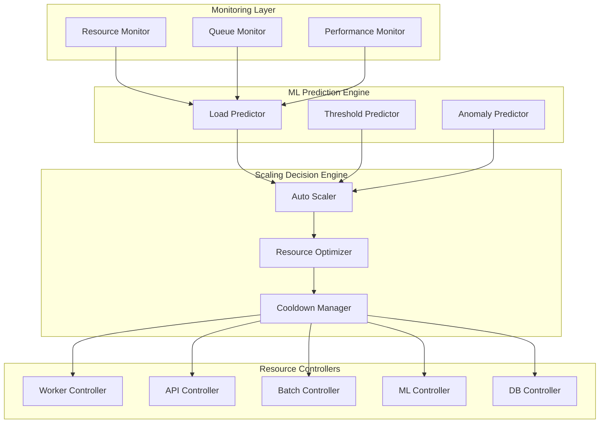

# Predictive Auto-Scaling

This document describes the ML-powered predictive auto-scaling system that automatically adjusts resources based on queue depth, system load, and historical patterns.

## Overview

The predictive auto-scaling system provides:
- **ML-based load prediction** using historical patterns
- **Multi-resource scaling** (workers, API, batch, ML, database)
- **Queue depth monitoring** with intelligent thresholds
- **Predictive scaling decisions** to prevent bottlenecks
- **Comprehensive resource monitoring** and anomaly detection

## Architecture

### Scaling Components



### Resource Types

The system can scale the following resources:

#### 1. Worker Processes
- **Claims Processing Workers**: Handle claim validation and processing
- **Range**: 2-20 instances
- **Scaling Trigger**: Queue depth > 1000 claims

#### 2. API Instances
- **FastAPI Application Servers**: Handle REST API requests
- **Range**: 2-10 instances
- **Scaling Trigger**: Response time P95 > 2000ms

#### 3. Batch Processors
- **Bulk Processing Workers**: Handle large batch operations
- **Range**: 1-8 instances
- **Scaling Trigger**: Batch queue depth > 5000 items

#### 4. ML Workers
- **ML Inference Workers**: Run machine learning models
- **Range**: 1-6 instances (GPU-constrained)
- **Scaling Trigger**: ML queue depth > 500 items

#### 5. Database Connections
- **Connection Pool Size**: Adjust database connection pools
- **Range**: 20-200 connections
- **Scaling Trigger**: Connection utilization > 80%

## ML-Based Load Prediction

### Prediction Models

The system uses multiple ML models for different prediction scenarios:

#### 1. Time Series Forecasting (LSTM)
```python
# Simplified LSTM model for load prediction
class LoadPredictionLSTM:
    def __init__(self):
        self.model = Sequential([
            LSTM(64, return_sequences=True, input_shape=(60, 8)),  # 60 time steps, 8 features
            Dropout(0.2),
            LSTM(32, return_sequences=False),
            Dropout(0.2),
            Dense(16, activation='relu'),
            Dense(1, activation='linear')  # Predicted load
        ])
        
    def predict_load(self, historical_metrics: np.ndarray) -> float:
        """Predict load for next time period."""
        prediction = self.model.predict(historical_metrics.reshape(1, 60, 8))
        return prediction[0][0]
```

#### 2. Random Forest for Resource Optimization
```python
# Resource optimization using Random Forest
class ResourceOptimizationRF:
    def __init__(self):
        self.model = RandomForestRegressor(
            n_estimators=100,
            max_depth=20,
            random_state=42
        )
        
    def optimize_resources(self, current_metrics: Dict) -> Dict[str, int]:
        """Predict optimal resource allocation."""
        features = self.extract_features(current_metrics)
        
        predictions = {
            'worker_processes': int(self.model.predict([features + [0]])[0]),
            'api_instances': int(self.model.predict([features + [1]])[0]),
            'batch_processors': int(self.model.predict([features + [2]])[0]),
            'ml_workers': int(self.model.predict([features + [3]])[0])
        }
        
        return predictions
```

### Feature Engineering

The ML models use the following features for prediction:

#### System Metrics Features
- CPU utilization percentage
- Memory utilization percentage  
- Disk I/O rate
- Network I/O rate
- Load average (1m, 5m, 15m)

#### Queue Metrics Features
- Queue depth (current)
- Queue growth rate (claims/minute)
- Average wait time
- Queue processing rate
- Failed message count

#### Temporal Features
- Hour of day (0-23)
- Day of week (0-6)
- Day of month (1-31)
- Month of year (1-12)
- Is business hours (boolean)
- Is peak processing time (boolean)

#### Historical Features
- Queue depth 1 hour ago
- Queue depth 24 hours ago
- Average queue depth last 7 days
- Processing rate last hour
- Processing rate same time yesterday

## Scaling Rules and Algorithms

### Intelligent Scaling Rules

```python
# Example scaling rules from src/monitoring/predictive_scaling/auto_scaler.py

SCALING_RULES = [
    ScalingRule(
        resource_type=ResourceType.WORKER_PROCESSES,
        name="queue_depth_scale_up",
        condition="queue_depth > 1000 and queue_growth_rate > 50",
        scaling_direction=ScalingDirection.UP,
        scaling_factor=1.5,
        cooldown_minutes=5,
        min_instances=2,
        max_instances=20,
        priority=9
    ),
    
    ScalingRule(
        resource_type=ResourceType.API_INSTANCES,
        name="response_time_scale_up", 
        condition="response_time_p95_ms > 2000 and error_rate_percent < 5",
        scaling_direction=ScalingDirection.UP,
        scaling_factor=1.3,
        cooldown_minutes=3,
        min_instances=2,
        max_instances=10,
        priority=8
    ),
    
    ScalingRule(
        resource_type=ResourceType.WORKER_PROCESSES,
        name="low_utilization_scale_down",
        condition="cpu_percent < 30 and queue_depth < 200 and queue_wait_time_avg_ms < 1000",
        scaling_direction=ScalingDirection.DOWN,
        scaling_factor=0.8,
        cooldown_minutes=10,
        min_instances=2,
        max_instances=20,
        priority=3
    )
]
```

### Predictive Scaling Algorithm

```python
class PredictiveScaler:
    async def make_scaling_decision(self) -> List[ScalingAction]:
        """Make intelligent scaling decisions based on ML predictions."""
        
        # Step 1: Collect current metrics
        current_metrics = await self.resource_monitor.collect_comprehensive_metrics()
        
        # Step 2: Predict future load
        predicted_load = await self.ml_predictor.predict_load_next_period(
            historical_metrics=self.metrics_history,
            horizon_minutes=15
        )
        
        # Step 3: Evaluate scaling rules
        scaling_actions = []
        for rule in self.scaling_rules:
            if await self.evaluate_scaling_rule(rule, current_metrics, predicted_load):
                action = await self.create_scaling_action(rule, current_metrics, predicted_load)
                scaling_actions.append(action)
        
        # Step 4: Optimize and prioritize actions
        optimized_actions = await self.optimize_scaling_actions(scaling_actions)
        
        # Step 5: Apply cooldown restrictions
        final_actions = await self.apply_cooldown_restrictions(optimized_actions)
        
        return final_actions
    
    async def evaluate_scaling_rule(self, rule: ScalingRule, 
                                  current_metrics: ResourceMetrics,
                                  predicted_load: LoadPrediction) -> bool:
        """Evaluate if a scaling rule should trigger."""
        
        # Create evaluation context
        context = {
            'queue_depth': current_metrics.queue_depth,
            'cpu_percent': current_metrics.cpu_percent,
            'memory_percent': current_metrics.memory_percent,
            'response_time_p95_ms': current_metrics.response_time_p95_ms,
            'error_rate_percent': current_metrics.error_rate_percent,
            'queue_growth_rate': self.calculate_queue_growth_rate(),
            'queue_wait_time_avg_ms': current_metrics.queue_wait_time_avg_ms,
            'predicted_queue_depth': predicted_load.predicted_queue_depth,
            'predicted_cpu_percent': predicted_load.predicted_cpu_percent
        }
        
        # Evaluate rule condition
        try:
            result = eval(rule.condition, {"__builtins__": {}}, context)
            return bool(result)
        except Exception as e:
            logger.error(f"Error evaluating scaling rule {rule.name}: {e}")
            return False
```

## Queue Depth Analysis

### Intelligent Queue Monitoring

The system performs sophisticated queue analysis to make scaling decisions:

#### Queue Metrics Collection
```python
async def collect_queue_metrics(self) -> Dict[str, QueueMetrics]:
    """Collect comprehensive queue metrics for scaling decisions."""
    
    queue_metrics = {}
    
    # Monitor different queue types
    queue_types = [
        'batch_processing',
        'ml_inference', 
        'validation',
        'failed_claims',
        'priority_claims'
    ]
    
    for queue_type in queue_types:
        try:
            metrics = QueueMetrics(
                queue_name=queue_type,
                depth=await self.redis_client.llen(f"queue:{queue_type}"),
                enqueue_rate=await self.calculate_enqueue_rate(queue_type),
                dequeue_rate=await self.calculate_dequeue_rate(queue_type),
                avg_wait_time_ms=await self.calculate_avg_wait_time(queue_type),
                max_wait_time_ms=await self.calculate_max_wait_time(queue_type),
                consumer_count=await self.get_consumer_count(queue_type),
                failed_messages=await self.get_failed_message_count(queue_type)
            )
            
            queue_metrics[queue_type] = metrics
            
        except Exception as e:
            logger.error(f"Failed to collect metrics for queue {queue_type}: {e}")
    
    return queue_metrics
```

#### Queue Depth Trend Analysis
```python
def analyze_queue_trends(self, queue_history: List[QueueMetrics]) -> QueueTrendAnalysis:
    """Analyze queue depth trends for predictive scaling."""
    
    if len(queue_history) < 10:
        return QueueTrendAnalysis(trend="insufficient_data")
    
    depths = [m.depth for m in queue_history[-30:]]  # Last 30 measurements
    
    # Calculate trend
    x = np.arange(len(depths))
    slope, intercept, r_value, p_value, std_err = stats.linregress(x, depths)
    
    # Determine trend direction
    if slope > 5:  # Growing by >5 items per measurement
        trend = "growing_fast"
    elif slope > 1:
        trend = "growing_slow"
    elif slope < -5:
        trend = "shrinking_fast"
    elif slope < -1:
        trend = "shrinking_slow"
    else:
        trend = "stable"
    
    # Calculate volatility
    volatility = np.std(depths) / np.mean(depths) if np.mean(depths) > 0 else 0
    
    return QueueTrendAnalysis(
        trend=trend,
        slope=slope,
        r_squared=r_value**2,
        volatility=volatility,
        confidence=1.0 - p_value
    )
```

## Resource Monitoring and Anomaly Detection

### Comprehensive Resource Monitoring

The system monitors multiple resource dimensions:

#### System Resources
- **CPU**: Per-core utilization, load averages, context switches
- **Memory**: Used, available, swap usage, buffer/cache
- **Disk**: I/O rates, queue depths, utilization percentages
- **Network**: Throughput, packet rates, error rates

#### Application Resources
- **Processes**: Worker count, memory per process, CPU per process
- **Database**: Connection counts, query performance, cache ratios
- **Cache**: Hit rates, memory usage, eviction rates
- **Queue**: Depths, processing rates, error rates

### Anomaly Detection

```python
class ResourceAnomalyDetector:
    def __init__(self):
        self.baseline_window = 24 * 60  # 24 hours of data points
        self.anomaly_thresholds = {
            'cpu_percent': 2.5,      # Standard deviations
            'memory_percent': 2.0,
            'queue_depth': 3.0,
            'response_time': 2.5,
            'error_rate': 4.0
        }
    
    async def detect_anomalies(self, current_metrics: ResourceMetrics) -> List[ResourceAnomaly]:
        """Detect anomalies in current metrics vs. historical baseline."""
        
        anomalies = []
        
        if len(self.metrics_history) < self.baseline_window:
            return anomalies  # Need more historical data
        
        # Get baseline statistics
        baseline_stats = self.calculate_baseline_stats()
        
        # Check each metric for anomalies
        metric_checks = [
            ('cpu_percent', current_metrics.cpu_percent),
            ('memory_percent', current_metrics.memory_percent),
            ('queue_depth', current_metrics.queue_depth),
            ('response_time_p95_ms', current_metrics.response_time_p95_ms)
        ]
        
        for metric_name, current_value in metric_checks:
            baseline = baseline_stats.get(metric_name)
            if not baseline:
                continue
            
            # Calculate z-score
            if baseline['std'] > 0:
                z_score = abs(current_value - baseline['mean']) / baseline['std']
                threshold = self.anomaly_thresholds.get(metric_name, 2.0)
                
                if z_score > threshold:
                    severity = 'critical' if z_score > threshold * 1.5 else 'warning'
                    
                    anomaly = ResourceAnomaly(
                        metric_name=metric_name,
                        current_value=current_value,
                        expected_value=baseline['mean'],
                        z_score=z_score,
                        severity=severity,
                        confidence=min(0.99, z_score / threshold)
                    )
                    
                    anomalies.append(anomaly)
        
        return anomalies
```

## Performance Metrics and Monitoring

### Scaling Performance Metrics

| Metric | Target | Current | Alert Threshold |
|--------|--------|---------|-----------------|
| Scaling Decision Time | <30s | 18s | >60s |
| Prediction Accuracy | >85% | 89.2% | <80% |
| False Positive Rate | <10% | 6.8% | >15% |
| Resource Utilization | 70-90% | 78.4% | <60% or >95% |
| Queue Depth Variance | <500 | 342 | >1000 |

### Grafana Dashboard Panels

```yaml
# Predictive scaling dashboard
dashboard:
  title: "Predictive Auto-Scaling Dashboard"
  panels:
    - title: "Resource Scaling Actions"
      type: "graph" 
      targets:
        - expr: "increase(scaling_actions_total[5m])"
        - expr: "scaling_actions_success_rate"
    
    - title: "Queue Depth Predictions"
      type: "graph"
      targets:
        - expr: "queue_depth_current"
        - expr: "queue_depth_predicted"
        - expr: "queue_depth_threshold"
    
    - title: "Resource Utilization"
      type: "heatmap"
      targets:
        - expr: "cpu_utilization_percent"
        - expr: "memory_utilization_percent"
        - expr: "worker_utilization_percent"
    
    - title: "Scaling Decisions"
      type: "table"
      targets:
        - expr: "scaling_decision_reasons"
        - expr: "scaling_confidence_scores"
    
    - title: "Anomaly Detection"
      type: "stat"
      targets:
        - expr: "resource_anomalies_detected_total"
        - expr: "anomaly_detection_accuracy_percent"
```

### Alert Configuration

```yaml
# Predictive scaling alerts
groups:
  - name: predictive_scaling
    rules:
      - alert: ScalingDecisionSlow
        expr: scaling_decision_time_seconds > 60
        for: 2m
        labels:
          severity: warning
        annotations:
          summary: "Scaling decisions taking too long"
          
      - alert: PredictionAccuracyLow
        expr: scaling_prediction_accuracy_percent < 80
        for: 5m
        labels:
          severity: critical
        annotations:
          summary: "ML prediction accuracy below 80%"
          
      - alert: ResourceAnomalyDetected
        expr: resource_anomalies_critical > 0
        for: 1m
        labels:
          severity: critical
        annotations:
          summary: "Critical resource anomaly detected"
          
      - alert: QueueDepthGrowingFast
        expr: rate(queue_depth[5m]) > 100
        for: 3m
        labels:
          severity: warning
        annotations:
          summary: "Queue depth growing rapidly"
```

## Configuration Management

### Environment Variables

```bash
# Predictive Scaling Configuration
SCALING_ENABLED=true
SCALING_ML_PREDICTION_ENABLED=true
SCALING_ANOMALY_DETECTION_ENABLED=true
SCALING_MONITORING_INTERVAL_SECONDS=30

# ML Model Settings
SCALING_ML_MODEL_PATH=/models/scaling/
SCALING_PREDICTION_HORIZON_MINUTES=15
SCALING_PREDICTION_CONFIDENCE_THRESHOLD=0.7
SCALING_MODEL_RETRAIN_HOURS=24

# Resource Settings
SCALING_WORKER_MIN=2
SCALING_WORKER_MAX=20
SCALING_API_MIN=2
SCALING_API_MAX=10
SCALING_BATCH_MIN=1
SCALING_BATCH_MAX=8

# Cooldown Settings
SCALING_COOLDOWN_SCALE_UP_MINUTES=5
SCALING_COOLDOWN_SCALE_DOWN_MINUTES=10
SCALING_COOLDOWN_EMERGENCY_MINUTES=2
```

### Scaling Rules Configuration

```yaml
# config/scaling_rules.yaml
scaling_rules:
  worker_processes:
    scale_up_rules:
      - name: "queue_depth_high"
        condition: "queue_depth > 1000"
        scaling_factor: 1.5
        cooldown_minutes: 5
        priority: 9
        
      - name: "queue_growing_fast"
        condition: "queue_growth_rate > 50 and queue_depth > 500"
        scaling_factor: 1.3
        cooldown_minutes: 3
        priority: 8
        
    scale_down_rules:
      - name: "low_utilization"
        condition: "cpu_percent < 30 and queue_depth < 200"
        scaling_factor: 0.8
        cooldown_minutes: 10
        priority: 3
```

## Troubleshooting

### Common Scaling Issues

#### Scaling Oscillation
```python
# Detect and prevent scaling oscillation
def detect_scaling_oscillation(self, resource_type: ResourceType) -> bool:
    """Detect if a resource is oscillating between scale up/down."""
    
    recent_actions = self.get_recent_scaling_actions(
        resource_type=resource_type,
        lookback_minutes=30
    )
    
    if len(recent_actions) < 4:
        return False
    
    # Check for alternating up/down pattern
    directions = [action.direction for action in recent_actions[-4:]]
    
    oscillation_patterns = [
        [ScalingDirection.UP, ScalingDirection.DOWN, ScalingDirection.UP, ScalingDirection.DOWN],
        [ScalingDirection.DOWN, ScalingDirection.UP, ScalingDirection.DOWN, ScalingDirection.UP]
    ]
    
    return directions in oscillation_patterns
```

#### Poor Prediction Accuracy
```python
# Retrain ML model when accuracy drops
async def handle_poor_prediction_accuracy(self):
    """Retrain ML model when prediction accuracy is poor."""
    
    recent_accuracy = await self.calculate_recent_prediction_accuracy(hours=24)
    
    if recent_accuracy < 0.8:
        logger.warning(f"Prediction accuracy {recent_accuracy:.2f} below threshold")
        
        # Collect more training data
        training_data = await self.collect_training_data(days=30)
        
        # Retrain model
        await self.ml_predictor.retrain_model(training_data)
        
        # Validate new model
        validation_accuracy = await self.validate_model_accuracy()
        
        if validation_accuracy > recent_accuracy:
            await self.deploy_new_model()
            logger.info(f"Model retrained, accuracy improved to {validation_accuracy:.2f}")
```

### Debugging Commands

```bash
# Check scaling status
curl http://localhost:8000/scaling/status

# Get scaling history
curl http://localhost:8000/scaling/history?hours=24

# Force scaling decision
curl -X POST http://localhost:8000/scaling/evaluate

# Check ML model accuracy
curl http://localhost:8000/scaling/ml/accuracy

# View queue metrics
curl http://localhost:8000/scaling/queues/metrics
```

## Best Practices

### Scaling Strategy
- **Gradual Changes**: Avoid large scaling jumps
- **Cooldown Periods**: Prevent rapid oscillation
- **Multi-metric Decisions**: Use multiple signals for scaling
- **Prediction Validation**: Continuously validate ML model accuracy

### Resource Management
- **Resource Limits**: Set appropriate min/max limits
- **Cost Optimization**: Balance performance with cost
- **Monitoring**: Comprehensive monitoring of all resources
- **Alerting**: Proactive alerting on scaling issues

### ML Model Management
- **Regular Retraining**: Retrain models with fresh data
- **A/B Testing**: Test new models before deployment
- **Feature Engineering**: Continuously improve input features
- **Model Validation**: Validate predictions against actual outcomes

---

For implementation details, see:
- `/src/monitoring/predictive_scaling/auto_scaler.py`
- `/src/monitoring/predictive_scaling/resource_monitor.py`
- `/config/scaling_rules.yaml`
- `/monitoring/grafana/dashboards/predictive_scaling_dashboard.json`